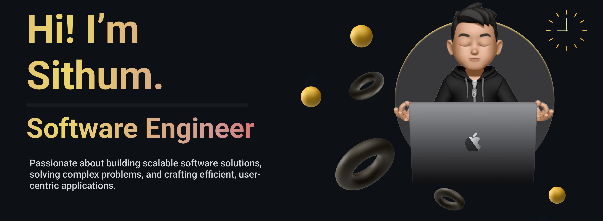

<!--Banner-->

<!--Night Owl image-->

  

<!--Header Name-->
#  HEY I'M SITHUM! 

<!--Start Intro-->               

I am a Full Stack Developer and Machine Learning Enthusiast with a huge love for Python, React.js, Node.js, SwiftUI, REST API and Data Visualization. 

- 🌱 I’m currently learning BSc.Computer Science at University of Westminster.
- 💬 Ask me about Android , MERN , IOS.
- ✍ I write technical blogs, You can visit my blog site at [DEV](https://medium.com/@sithum18raveesha).
- ❤ Contributing to Open Source.
- 💻 Visit my [Portfolio](https://sithum-raveesha.vercel.app/) for more details about me.
- 📫 How to reach me : sithum18raveesha@gmail.com.
<!--End Intro-->

<!--Profile Count Badge-->

  

---
<!--Languages and Tools Section-->       
<h2 align="center">&nbsp;Tᴇᴄʜ sᴛᴀᴄᴋ & Lᴀᴛᴇsᴛ ʙʟᴏɢs</h2> 
<picture>
  <source media="(prefers-color-scheme: dark)" srcset="./Skills_Animation_Dark.gif">
  <source media="(prefers-color-scheme: light)" srcset="./Skills_Animation_White.gif">
  
</picture>
 

<h3 align="left">Current Learning</h3>
<ul align="left">
  <li>Deepening my knowledge in Machine Learning and AI.</li>
  <li>Exploring advanced React.js, Next.js patterns and state management techniques.</li>
  <li>Improving my skills in cloud computing with AWS and Azure.</li>
</ul>
  
<h3 align="left">Latest Blog Posts</h3>
<ul align="left">
  <li><a href="https://medium.com/@sithum18raveesha/dynamic-price-optimization-using-reinforcement-learning-4a74776431a3">💰 Dynamic Price Optimization Using Reinforcement Learning</a></li>
  <li><a href="https://medium.com/@sithum18raveesha/architecting-serverless-applications-with-aws-5b0b4db3baf7">🏗 Architecting Serverless Applications with AWS</a></li>
</ul>
 
 
 
 
 

<!--Github stats Table--> 
<h2 align="center">📊 Gɪᴛʜᴜʙ Sᴛᴀᴛs 📊</h2>

<table width="100%" style="background: linear-gradient(135deg, #000000 0%, #1a1100 25%, #332200 50%, #4d3300 75%, #664400 100%);"> 
<tr> 
<td width="50%"> 
<h3 align="center" style="color: #f2d675;"><strong>Gɪᴛʜᴜʙ Sᴛᴀᴛs</strong></h3> 

 
 

 
</td> 
<td width="50%"> 
<h3 align="center" style="color: #f2d675;"><strong>Sᴛʀᴇᴀᴋ Sᴛᴀᴛs</strong></h3> 

 
 

 
</td> 
</tr> 
<tr> 
<td width="50%"> 
<h3 align="center" style="color: #f2d675;"><strong>Lᴀᴛᴇsᴛ Pʀᴏᴊᴇᴄᴛ</strong></h3> 

 
 

 
</td> 
<td width="50%"> 
<h3 align="center" style="color: #f2d675;"><strong>Tᴏᴘ Cᴏɴᴛʀɪʙᴜᴛɪᴏɴs</strong></h3> 

 
 

 
</td> 
</tr> 
</table>

 
